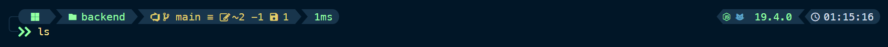
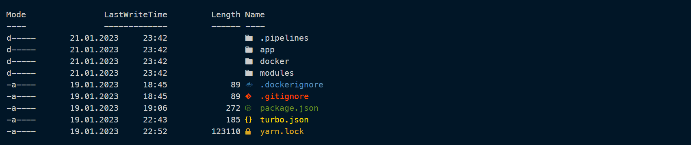

# Oh My Posh Setup

> Oh My Posh is a custom prompt engine for any shell that has the ability to adjust the prompt string with a function or variable.

This guide may be outdated, so please visit the official documentation of [oh my posh](https://ohmyposh.dev/docs/) if you run into any problems. This guide also quotes the documentation, so shoutout to their awesome product. 

## Windows

### Installation

Open a PowerShell prompt and run the following command:

```powershell
winget install JanDeDobbeleer.OhMyPosh -s winget
Install-Module -Name PSReadLine -AllowClobber -Force
Install-Module -Name Terminal-Icons -Repository PSGallery
```

> Oh My Posh was designed to use Nerd Fonts. Nerd Fonts are popular fonts that are patched to include icons. We recommend Meslo LGM NF, but any Nerd Font should be compatible with the standard themes.

```powershell
oh-my-posh font install
```

You can install the desired fonts via their cli tool. If the installation was successful, you must configure the font in the windows terminal and in vscode's integrated terminal.

Open the windows terminal settings with `CTRL + SHIFT + ,` and edit the default values in the `settings.json` file to you your installed font:

```json
{
  "profiles": {
    "defaults": {
      "font": {
        "face": "MesloLGM NF"
      }
    }
  }
}
```

Now open the vs code `settings.json` file with `CTRL + SHIFT + P` > `Open user settings (JSON)`.

```json
{
  "terminal.integrated.fontFamily": "MesloLGM NF"
}
```

You now have to create a script for the terminal, which is run on every startup. This script initializes oh my posh and it's themes.

Create a new profile script

```powershell
New-Item -Path $PROFILE -Type File -Force
```

and open it for example with `notepad $PROFILE` to edit it, but before you do so, first create a file for your theme configuration in any path you want (e.g. `C:/Terminal/theme.json`).

Now add the following lines to the script and save it:

```powershell
oh-my-posh init pwsh | Invoke-Expression
oh-my-posh --init --shell pwsh --config C:/Terminal/theme.json | Invoke-Expression
Import-Module -Name Terminal-Icons
```

Restart the profile with `. $PROFILE` to see the changes take effect.

## Theming

For Theming purposes, I highly recommend to take a look at the [official documentation](https://ohmyposh.dev/docs/configuration/overview).

If you just want a quick and working terminal, you could also use my [own configuration](./theme.json) and paste it into yours.

## Demo

If you decide to choose my configuration, it should look like this (btw. I'm using Night Owl in VSCode).



